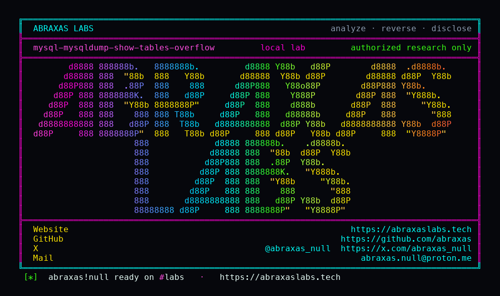

<p align="center">
  
</p>

<p align="center">
  <a href="https://abraxaslabs.tech"><strong>abraxaslabs.tech</strong></a>
  &nbsp;·&nbsp;
  <a href="https://github.com/abraxas">github.com/abraxas</a>
  &nbsp;·&nbsp;
  <a href="https://x.com/abraxas_null">@abraxas_null</a>
  &nbsp;·&nbsp;
  <a href="mailto:abraxas.null@proton.me">abraxas.null@proton.me</a>
  &nbsp;·&nbsp;
  <a href="https://github.com/abraxas/mysql-mysqldump-show-tables-overflow">mysql-mysqldump-show-tables-overflow</a>
</p>

# mysql-mysqldump-show-tables-overflow

**MySQL Community Server** `mysqldump` `26.7.0` (`06a5c1c`) - Oracle

Default `mysqldump` copies `SHOW TABLES` names with no `NAME_LEN` cap. `getTableName` returns a raw `mysql_fetch_row`. `dump_all_tables_in_db` `my_stpcpy`s that string into `hash_key[2*NAME_LEN+2]` and `quote_name` writes it into a 387-byte stack buffer with no bound. A hostile server that answers a table name longer than 192 bytes crashes the dump UID.

A real `mysqld` will not emit identifiers that long. The leftover is the client trusting the protocol.

| | |
|---|---|
| ID | no CVE yet |
| CWE | [CWE-120](https://cwe.mitre.org/data/definitions/120.html), [CWE-121](https://cwe.mitre.org/data/definitions/121.html) |
| CVSS | **High: 8.8** `CVSS:3.1/AV:N/AC:L/PR:N/UI:R/S:U/C:H/I:H/A:H` |
| Product | [MySQL Community Server](https://github.com/mysql/mysql-server) `mysqldump` |
| Affected | **26.7.0** (`06a5c1c99c377fc41b2eba1ea244e8b220bdc3c8`) |
| Auth | victim runs default `mysqldump` against an attacker MySQL |
| License | [GNU Affero GPL v3.0](LICENSE) |
| Lab | `127.0.0.1` only. Crash witness. No RIP payload. |

## What an attacker can do

Stand up a MySQL-protocol server. Complete the handshake. Answer session `SET`s. When the client sends `show tables`, return one row whose name is tens of kilobytes long.

The operator who pointed `mysqldump testdb` at that host overflows a stack buffer in the dump process. Lab on `mysqldump  Ver 26.7.0` is **SIGSEGV**. Reliable instruction-pointer control is not part of this pack. The crash is.

Same victim model as a backup client pointed at a malicious server. `lock_tables` is default via `--opt`. The overflow is in that first `SHOW TABLES` loop.

## How I found it

Thirty-one source hunts of [mysql/mysql-server](https://github.com/mysql/mysql-server) tag `mysql-26.7.0`. Default `mysqld` unpublished Crit/High came back empty. July 2026 CPU High Server rows are closed on this pin. Client tools were the leftover class, same shape as PostgreSQL `pg_basebackup` following a hostile path.

```c
static char *getTableName(int reset) {
  static MYSQL_RES *res = nullptr;
  MYSQL_ROW row;
  if (!res) {
    if (!(res = mysql_list_tables(mysql, NullS))) return (nullptr);
  }
  if ((row = mysql_fetch_row(res))) return ((char *)row[0]);
```

```c
static char *quote_name(char *name, char *buff, bool force) {
  char *to = buff;
  const char qtype = ansi_quotes_mode ? '"' : '`';
  if (!force && !opt_quoted && !test_if_special_chars(name)) return name;
  *to++ = qtype;
  while (*name) {
    if (*name == qtype) *to++ = qtype;
    *to++ = *name++;
  }
```

`NAME_LEN` is `64 * 3 = 192`. `hash_key` is 386 bytes. `quote_name` in `dump_table` writes into `table_buff[NAME_LEN+3]`.

Wrong turns already recorded: treating a real `mysqld` as the oracle (it will not emit a 193-byte identifier); a 4KiB name absorbed by `real_columns[MAX_FIELDS]` on the same frame as `hash_key`; compiling ASan from the full server tree; calling the crash instruction-pointer control.

## Lab

```bash
cd lab
./run.sh
```

Image `mysql:26.7.0`. Hostile stub on compose `stub:3306` (control, table `t`) and `stub:3307` (overflow, 64KiB name plus witness). Published `127.0.0.1:18600` / `18601`. Bind it to loopback.

```text
control-rc=2 control-signal=0
overflow-rc=139 overflow-signal=SIGSEGV
SUCCESS mysql-mysqldump-show-tables-overflow ... MYSQL-DUMP-SHOW-TABLES-OVERFLOW-WITNESS
```

Control prints a 26.7.0 dump header and exits 2 on SQL 1146. Overflow dies right after `show tables`. No `LOCK TABLES` on that connection.

## The fix

Cap `getTableName` at `NAME_LEN`. Give `quote_name` a buffer length and refuse to write past it. `my_stpcpy` into `hash_key` should be a bounded copy. A hostile `SHOW TABLES` name is not a table.

## References

- [github.com/mysql/mysql-server](https://github.com/mysql/mysql-server) tag [mysql-26.7.0](https://github.com/mysql/mysql-server/tree/mysql-26.7.0) (`06a5c1c99c377fc41b2eba1ea244e8b220bdc3c8`)
- [`client/mysqldump.cc`](https://github.com/mysql/mysql-server/blob/mysql-26.7.0/client/mysqldump.cc) `getTableName`, `quote_name`, `dump_all_tables_in_db`
- [`include/mysql_com.h`](https://github.com/mysql/mysql-server/blob/mysql-26.7.0/include/mysql_com.h) `NAME_LEN`
- [`libmysql/libmysql.cc`](https://github.com/mysql/mysql-server/blob/mysql-26.7.0/libmysql/libmysql.cc) `mysql_list_tables`
